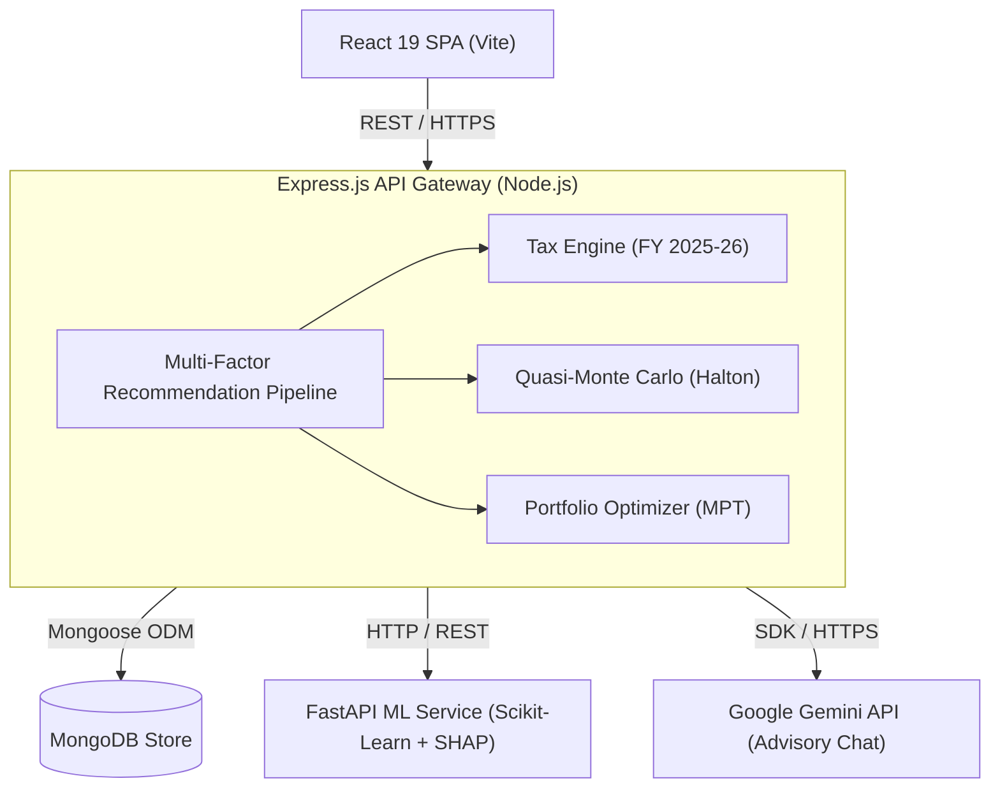
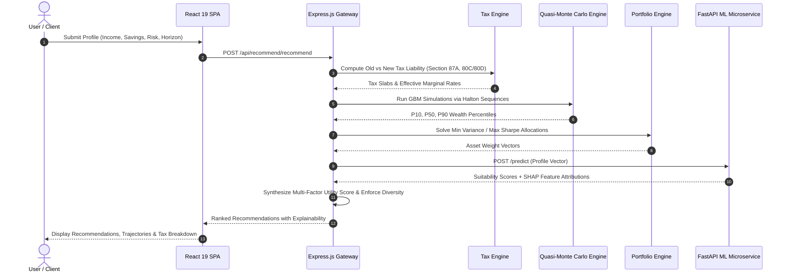

# WealthGenie

[](https://react.dev/)
[](https://expressjs.com/)
[](https://fastapi.tiangolo.com/)
[](https://scikit-learn.org/)
[](LICENSE)

A decoupled, full-stack financial advisory and wealth management platform built for Indian retail investors. **WealthGenie** combines multi-factor asset scoring, stochastic Quasi-Monte Carlo wealth projection, Markowitz modern portfolio theory, progressive tax optimization under Indian FY 2025-26 rules, and explainable ML recommendation pipelines.

---

## 🏛 System Architecture

WealthGenie uses a decoupled three-tier microservice architecture to separate user interaction, core financial computation, and machine learning inference.



---

## 🔄 Computational & Recommendation Pipeline

The diagram below details the data flow when evaluating investor profiles, calculating tax efficiencies, optimizing allocations, and deriving explainable recommendations:



---

## ⚡ Core Computational Engines

### 1. Progressive Tax Engine (Indian FY 2025-26)
Calculates exact tax liabilities under both the **Old Tax Regime** and **New Tax Regime** to identify the optimal filing path.
- **New Regime Slab Modeling**: 0% (₹0–4L), 5% (₹4L–8L), 10% (₹8L–12L), 15% (₹12L–16L), 20% (₹16L–20L), 25% (₹20L–24L), and 30% (>₹24L).
- **Old Regime Slab Modeling**: 0% (₹0–2.5L), 5% (₹2.5L–5L), 20% (₹5L–10L), and 30% (>₹10L).
- **Section 87A Rebate Cliffs**: Computes full tax relief up to ₹7L (Old) and ₹12L (New) with exact marginal relief formulas to eliminate tax cliff artifacts.
- **Granular Surcharge Tiers & Deductions**: Implements multi-bracket surcharges (10%, 15%, 25%, 37%) with marginal relief caps, standard deductions, Section 80C, 80D (self/senior breakdown), and Section 80CCD(2) employer NPS rules.

### 2. Quasi-Monte Carlo Stochastic Engine
Evaluates sequence-of-returns risk over multi-year investment horizons using low-discrepancy **Halton sequence generators**.
- **Geometric Brownian Motion (GBM)**: Simulates asset trajectories incorporating log-normal monthly drift ($\mu$) and volatility ($\sigma$).
- **Wealth Distribution Bands**: Outputs 10th percentile ($P_{10}$ conservative), 50th percentile ($P_{50}$ median), and 90th percentile ($P_{90}$ optimistic) growth trajectories alongside goal probability bounds.

### 3. Portfolio Optimization Engine
Provides three distinct asset allocation strategies derived from Modern Portfolio Theory (MPT):
- **Minimum Variance**: Solves quadratic optimization to minimize portfolio variance ($\mathbf{w}^T \mathbf{\Sigma} \mathbf{w}$).
- **Maximum Sharpe Ratio**: Maximizes excess return per unit of risk ($\frac{\mathbf{w}^T \mathbf{\mu} - R_f}{\sqrt{\mathbf{w}^T \mathbf{\Sigma} \mathbf{w}}}$).
- **Risk Parity**: Equalizes risk contributions across asset classes using iterative risk budget optimization.

### 4. Four-Stage Recommendation Pipeline
Orchestrates metadata-driven recommendation scoring across financial instruments:
1. **Eligibility Filtering**: Gating instruments by age boundaries, income minimums, and lock-in constraints.
2. **Multi-Factor Utility Scoring**: Weighing returns, risk capacity alignment, tax efficiency, liquidity, expense ratios, and horizon fit.
3. **ML Confidence Boosting**: Merging FastAPI microservice model confidence into relative scoring ranks.
4. **Diversity Enforcement**: Guaranteeing top recommendations span distinct asset classes.

### 5. Explainable ML Engine (FastAPI)
- Uses trained Random Forest tree ensemble models to evaluate investor risk profiles and output asset suitability confidence scores.
- Computes **TreeSHAP (SHapley Additive exPlanations)** feature attributions for every prediction, rendering transparent explanations for recommended allocations.

---

## 🛠 Technology Stack

| Tier | Technology | Purpose |
| :--- | :--- | :--- |
| **Frontend** | React 19, Vite, Vanilla CSS | Responsive UI, interactive charts, and real-time calculation dashboards |
| **Backend API** | Node.js, Express.js, Mongoose | API Routing, financial math engines, session management |
| **Database** | MongoDB | Document store for user profiles, portfolio snapshots, and investment catalogs |
| **ML Service** | Python 3.12, FastAPI, Scikit-Learn, SHAP | Machine learning inference, suitability scoring, model explainability |
| **Testing** | Node.js Test Runner, Vitest, Pytest | Multi-tier test suites across unit, integration, and ML components |

---

## 📁 Repository Organization

```
deploy-wealthgenie/
├── reactapp/                 # Frontend React Single Page Application
│   ├── src/
│   │   ├── components/       # Dashboard screens, modals, and input controls
│   │   ├── engine/           # Client-side tax and SIP calculation helpers
│   │   └── services/         # Axios API client modules
│   ├── package.json
│   └── vite.config.js
│
├── server/                   # Backend Express.js REST API
│   ├── services/             # Core analytical engines (Tax, Monte Carlo, Portfolio, Recommendation)
│   ├── routes/               # API route handlers (/api/tax, /api/portfolio, /api/recommend, /api/montecarlo)
│   ├── models/               # Mongoose schema definitions (User, Profile, Instrument)
│   ├── test/                 # Node.js native unit & integration test suite
│   └── package.json
│
├── ml-service/               # FastAPI Machine Learning Microservice
│   ├── model/                # Training pipelines, dataset builders, model persistence
│   ├── tests/                # Pytest suite for ML validation
│   ├── main.py               # FastAPI service initialization and endpoint handlers
│   └── requirements.txt
│
└── README.md
```

---

## 🏁 Getting Started

### Prerequisites
- **Node.js**: `v20.x` or `v22.x`
- **Python**: `v3.12+`
- **MongoDB**: Local MongoDB instance or Atlas connection URI

---

### Step 1: Clone the Repository
```bash
git clone https://github.com/yashaskn8/deploy-wealthgenie.git
cd deploy-wealthgenie
```

### Step 2: Set Up Backend (`server/`)
```bash
cd server
npm install

# Create environment configuration
cp .env.example .env
```

*Sample `server/.env`:*
```env
PORT=5000
MONGODB_URI=mongodb://localhost:27017/wealthgenie
JWT_SECRET=your_jwt_secret_key
GEMINI_API_KEY=your_google_gemini_key
ML_SERVICE_URL=http://localhost:8000
```

Start the backend server:
```bash
npm run dev
```

### Step 3: Set Up Frontend (`reactapp/`)
```bash
cd ../reactapp
npm install
npm run dev
```
Access the application at `http://localhost:5173`.

### Step 4: Set Up ML Microservice (`ml-service/`)
```bash
cd ../ml-service
python -m venv .venv

# Activate Virtual Environment:
# Windows: .venv\Scripts\activate
# Linux/macOS: source .venv/bin/activate

pip install -r requirements.txt
uvicorn main:app --reload --port 8000
```

---

## 📡 API Endpoint Summary

| Method | Endpoint | Description |
| :--- | :--- | :--- |
| `GET / POST` | `/api/tax/compute`, `/api/tax/compare` | Evaluates Old vs. New tax regime liabilities for income/deduction profile |
| `POST` | `/api/portfolio/optimize` | Solves Min Variance, Max Sharpe, or Risk Parity allocations for selected assets |
| `POST` | `/api/portfolio/rebalance` | Calculates target drift and transactional directives for current portfolio |
| `POST` | `/api/montecarlo/simulate` | Runs Quasi-Monte Carlo simulation and returns $P_{10}, P_{50}, P_{90}$ wealth bands |
| `POST` | `/api/recommend/recommend` | Runs 4-stage scoring pipeline and returns ranked investment suggestions |
| `POST` | `/api/chat/message` | Context-aware AI advisory assistance grounded in user financial profile |

---

## 🧪 Testing Suite Execution

Run unit and integration test suites across all three microservices:

```bash
# 1. Backend Service Unit Tests
cd server
npm test

# 2. Frontend Vitest Suite
cd ../reactapp
npm test

# 3. ML Microservice Pytest Suite
cd ../ml-service
pytest
```

---

## 📜 License

Distributed under the MIT License. See `LICENSE` for details.
