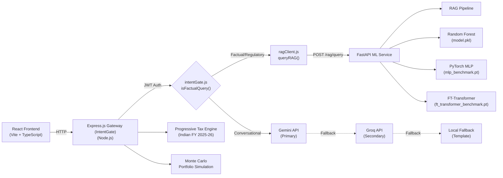
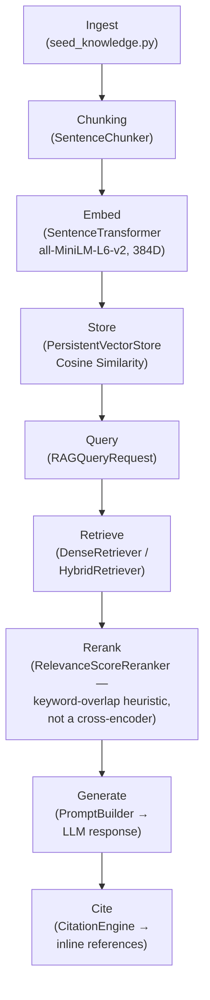

# WealthGenie

Indian investor financial advisory platform: risk profiling via ML classifiers, tax regulation Q&A via RAG, and chat-based financial guidance via dual LLM providers.

---

## Known Limitations

> These are listed first, not buried at the bottom, because they affect how you read the rest of this document.

- **LoRA/QLoRA fine-tuning is interface-only and non-functional.** The `llm/` module defines `FineTuningConfig` and provider stubs, but no fine-tuning has been executed. The LLM eval numbers below are from the base (non-fine-tuned) `Qwen/Qwen2.5-0.5B-Instruct` model.
- **No computer vision or VLM component**, by design. This platform handles tabular ML, text RAG, and regulatory advisory only. Vision work is a separate project.
- **RAG "_all" aggregate metrics are inflated.** The blended `mean_recall_at_4_all` (0.9714) includes 10 out-of-domain negative controls that score vacuous 1.0s because they have no ground-truth chunks. The in-domain numbers (25 queries, 96.0% Recall@4) are the retrieval-quality measure. This caveat is repeated in the evaluation tables below.
- **Neural network benchmarks are not converged.** MLP (50 epochs) and FT-Transformer (30 epochs) were trained on CPU with no hyperparameter search. The committed numbers reflect what was actually measured, not projected performance.
- **Observed retrieval miss**: an 80C/ELSS query returned an 80CCD/NPS citation in a passing integration test — known, not investigated further.
- **The reranker is a lightweight keyword-overlap heuristic** (`RelevanceScoreReranker`), not a cross-encoder or learned model.

---

## Architecture



Every box in this diagram corresponds to a wired code path:
- `intentGate.js` → `geminiChatService.js:103` calls `isFactualQuery(message)`
- `ragClient.js` → `geminiChatService.js:105` calls `queryRAG()`
- Gemini/Groq fallback chain → `providerAbstraction.js` via `ProviderManager`
- FastAPI routes → `ml-service/main.py` and `ml-service/rag/router.py`

---

## RAG Pipeline Flow



Retrieval uses cosine similarity between the query embedding and stored chunk embeddings:

$$\text{cosine\_similarity}(\mathbf{q}, \mathbf{d}) = \frac{\mathbf{q} \cdot \mathbf{d}}{||\mathbf{q}|| \cdot ||\mathbf{d}||}$$

The reranker (`relevance_reranker.py`) applies a weighted heuristic:

$$\text{reranked\_score} = \alpha \cdot \text{retrieval\_score} + \beta \cdot \text{keyword\_overlap} + \gamma \cdot \text{title\_match}$$

where α = 0.5, β = 0.35, γ = 0.15.

---

## Evaluation Results

### RAG Retrieval (In-Domain, 25 Hand-Labeled Queries)

| Metric | In-Domain (n=25) | All (n=35)¹ |
| :--- | :---: | :---: |
| **Recall@4** | 0.9600 | 0.9714 |
| **MRR** | 0.9600 | 0.9714 |
| **NDCG@4** | — | 0.9679 |
| **Hit Rate** | 0.9600 | 0.9714 |
| **Citation Accuracy** | 1.0000 | 1.0000 |
| **Mean Grounding Score** | — | 0.7716 |

> ¹ **"All" metrics caveat**: The 35-query set includes 10 out-of-domain negative controls (queries with no ground-truth chunks). These score vacuous 1.0 on recall/MRR/NDCG because there is nothing to miss. The in-domain column (n=25) is the retrieval-quality measure.

**Source**: `ml-service/reports/rag_eval_report.json` → `aggregate_metrics`

---

### Embedding Provider Ablation (Hash vs. Semantic, 35 Queries)

| Metric | Hash (`DenseVectorEmbeddingProvider`, 128D) | Semantic (`all-MiniLM-L6-v2`, 384D) | Uplift |
| :--- | :---: | :---: | :---: |
| **In-Domain Recall@4** | 0.9800 | 1.0000 | +0.0200 |
| **In-Domain Hit Rate** | 1.0000 | 1.0000 | 0.0000 |
| **MRR** | 0.8833 | 0.9733 | +0.0900 |
| **NDCG@4** | 0.8975 | 0.9800 | +0.0825 |
| **Execution Time (35 queries)** | 0.03s | 0.52s | +0.49s |

**Source**: `ml-service/reports/embedding_ablation.json`

---

### Multi-Model Classification Benchmark

Dataset: 20,000 NAV-derived samples, 16 engineered features, 6 risk classes. Split: 60/20/20 (stratified, seed 42).

| Model | Accuracy | Balanced Accuracy | Macro F1 | MCC | Training Time |
| :--- | :---: | :---: | :---: | :---: | :---: |
| **Random Forest** (100 trees, max_depth=15) | 0.9563 | 0.9221 | 0.9144 | 0.9393 | 4.16s |
| **PyTorch MLP** (64→32, ReLU, BN, dropout 0.2) | 0.9560 | 0.9126 | 0.9174 | 0.9390 | 17.50s |
| **FT-Transformer** (d=32, 3 blocks, 4 heads) | 0.9705 | 0.9220 | 0.9331 | 0.9590 | 79.15s |

> **Caveat**: MLP trained 50 epochs, FT-Transformer trained 30 epochs, both on CPU. These are **not converged models**. With GPU training and hyperparameter search, neural network performance may differ. The numbers above reflect only what was actually measured.

**Source**: `ml-service/reports/multi_model_benchmark.json` → `models` → each model's top-level fields

---

### Base LLM Evaluation (Non-Fine-Tuned)

Model: `Qwen/Qwen2.5-0.5B-Instruct` (base open-weight, **not fine-tuned**). Evaluated on 25 financial advisory prompts against hand-labeled gold reference answers.

| Metric | Value | What it measures |
| :--- | :---: | :--- |
| **Mean BLEU** | 0.0278 | N-gram precision with brevity penalty |
| **Mean ROUGE-1** | 0.3928 | Unigram recall against gold reference |
| **Mean ROUGE-L** | 0.2844 | Longest common subsequence recall |
| **Mean Lexical Overlap** | 0.4998 | Rescaled Jaccard (formula below) |
| **Mean Semantic Similarity** | 0.6660 | SentenceTransformer cosine similarity (384D) |
| **Mean Faithfulness** | 0.5608 | Lexical grounding ratio against context |
| **Mean Latency** | 8445.73ms | End-to-end generation time per sample |

> This is a **base model baseline**. The low BLEU (0.0278) and ROUGE-L (0.2844) are expected — the model generates plausible but generic financial advice without domain grounding. Fine-tuning is explicitly out of scope for this evaluation pass.

**Source**: `ml-service/reports/llm_eval_report.json` → `aggregate_metrics`

---

## Formulas Used in Evaluation Code

These formulas are implemented in `ml-service/llm/evaluation/metrics.py` and `ml-service/rag/evaluation/evaluator.py`.

**Lexical Overlap Score** (`compute_lexical_overlap_score`):

$$\text{score} = 0.4 + 0.6 \times \frac{|R \cap C|}{|R \cup C|}$$

where R = reference token set, C = candidate token set. This is a rescaled Jaccard index, **not** BERTScore.

**Recall@K** (`rag/evaluation/evaluator.py`):

$$\text{Recall@K} = \frac{|\text{retrieved}_K \cap \text{relevant}|}{|\text{relevant}|}$$

**Mean Reciprocal Rank (MRR)**:

$$\text{MRR} = \frac{1}{\text{rank of first relevant result}}$$

**NDCG@K** (Normalized Discounted Cumulative Gain):

$$\text{DCG@K} = \sum_{i=1}^{K} \frac{\text{rel}_i}{\log_2(i+1)} \qquad \text{NDCG@K} = \frac{\text{DCG@K}}{\text{IDCG@K}}$$

**Perplexity** (`compute_perplexity`):

$$\text{PPL} = e^{\text{loss}}$$

---

## LLM Provider Architecture

### Registry Pattern (`llm/registry.py`)

`LLMModelRegistry` manages provider registration, runtime switching, and active model targeting:

- **Default provider**: Loaded from `LLMConfig.default_provider` at startup via `LocalLLMLoader.load_provider()`
- **Runtime switching**: `set_active_provider(key)` swaps the active backend without restart
- **Provider listing**: `list_models()` returns all registered providers with metadata (model name, device, quantization, version)

### Available Providers

| Provider | Class | Purpose |
| :--- | :--- | :--- |
| `huggingface` | `HuggingFaceLLMProvider` | Loads and serves open-weight LLMs (Qwen, Llama, Mistral) via Transformers. Default model: `Qwen/Qwen2.5-0.5B-Instruct`. Supports `load_weights=True` for real inference. |
| `mock` | `MockLLMProvider` | Domain-aware synthetic responses for **dev/offline testing only**. Falls back to this if no real provider is loaded. Explicitly not for production use. |

### Generation Behavior

`HuggingFaceLLMProvider.generate()` raises on failure — it does not fabricate fallback text. If model weights are not loaded (`load_weights=False`), the provider returns a metadata-only response indicating the model is in metadata-only mode.

---

## Security & Production Integrity

### API Key Authentication (Fail-Closed)

`verify_api_key()` in `ml-service/main.py` enforces API key authentication on all prediction and RAG endpoints:

- **If `ML_SERVICE_API_KEY` is set**: Requests must include a matching `X-API-Key` header (compared via `hmac.compare_digest`). Mismatches return HTTP 401.
- **If `ML_SERVICE_API_KEY` is not set**:
  - `ENVIRONMENT=local` → permits dev-mode bypass (returns `"dev-mode"`)
  - Any other environment → returns **HTTP 500** (server misconfiguration). This is a fail-closed default.
- **Previous behavior (fixed)**: The original implementation returned `"dev-mode"` whenever the key was unset, regardless of environment — a fail-open bug that silently disabled auth in any deployment.
- **Verified by**: `test_fail_closed_auth_when_api_key_unset` and `test_dev_mode_auth_bypass_with_local_environment` in `ml-service/tests/test_ml_validation.py` (both pass).

### JWT Authentication (Express Gateway)

The Express gateway authenticates users via JWT tokens signed with HS256 (`jsonwebtoken` library). Tokens are validated in `server/middleware/auth.js`.

---

## Core Computational & AI Engines

### 1. RAG Subsystem (FastAPI)

Retrieval-augmented generation for Indian tax regulations, mutual fund guidelines, and investment instrument facts. Ingests seed knowledge from `rag/seed_knowledge.py`, chunks via sentence boundary detection, embeds with `all-MiniLM-L6-v2` (384D), stores in `PersistentVectorStore`, retrieves via dense cosine similarity, reranks with a keyword-overlap heuristic, and generates cited answers.

Evaluated on 25 in-domain queries: Recall@4 = 0.9600, MRR = 0.9600, Citation Accuracy = 1.0000. Report: `ml-service/reports/rag_eval_report.json`.

### 2. ML Classification Engine (FastAPI)

Three models serve investor risk profiling from 16 engineered features (age, income, savings ratio, debt-to-income, emergency fund months, etc.):
- **Random Forest**: `model.pkl` (Scikit-Learn) — 95.63% accuracy, TreeSHAP explainability via `explainer.py`
- **PyTorch MLP**: `mlp_benchmark.pt` — 95.60% accuracy
- **FT-Transformer**: `ft_transformer_benchmark.pt` — 97.05% accuracy (Gorishniy et al., NeurIPS 2021)

### 3. Progressive Tax Engine (Indian FY 2025-26)

Calculates income tax under both Old and New regimes with Section 80C/80D deductions, standard deduction, HRA exemption, and Section 87A rebate. Implemented in `server/services/taxEngine.js`.

---

## API Endpoint Summary

### Express Gateway (Node.js)

| Method | Route | Description |
| :--- | :--- | :--- |
| POST | `/api/auth/register` | User registration |
| POST | `/api/auth/login` | JWT token issuance |
| POST | `/api/auth/logout` | Session invalidation |
| POST | `/api/chat/message` | Chat (intent-gated RAG or LLM) |
| POST | `/api/profile` | Create/update financial profile |
| GET | `/api/profile` | Retrieve financial profile |
| POST | `/api/recommend/generate` | Generate recommendations |
| POST | `/api/goals` | Create financial goal |
| GET | `/api/goals` | List user goals |
| POST | `/api/tax/calculate` | Tax computation (Old + New regime) |
| POST | `/api/portfolio/xirr` | XIRR calculation |
| POST | `/api/montecarlo/simulate` | Monte Carlo portfolio simulation |
| GET | `/api/health` | Health check |

### FastAPI ML Service

| Method | Route | Description |
| :--- | :--- | :--- |
| POST | `/predict` | Random Forest prediction |
| POST | `/predict/enriched` | RF prediction with SHAP explanations |
| POST | `/predict/pytorch` | MLP prediction |
| POST | `/predict/ft_transformer` | FT-Transformer prediction |
| POST | `/predict/compare` | Compare all 3 models |
| POST | `/rag/query` | RAG retrieval + generation |
| POST | `/rag/ingest` | Ingest new documents |
| GET | `/health` | Health check |

---

## Testing

### Express (Node.js)

```bash
cd server
npm install
npm test          # 21 test files, node:test runner
npm run test:coverage  # c8 coverage report
```

### FastAPI (Python)

```bash
cd ml-service
pip install -r requirements.txt
python -m pytest tests/test_ml_validation.py -v -p no:phoenix
# 9 passed, 2 skipped (skipped tests require running server)
```

### RAG Integration Test

```bash
cd server
node --test test/ragIntegration.test.js
# 2 pass: factual routing (with graceful fallback if ML service offline), conversational routing
```

### Docs-Code Sync Check

```bash
node scripts/check_docs_sync.js
```

Statically verifies that README architecture claims match actual code in `geminiChatService.js`, `ragClient.js`, and `ml-service/main.py`.

---

## Technology Stack

| Layer | Technology |
| :--- | :--- |
| **Frontend** | React 18, Vite, TypeScript |
| **API Gateway** | Express 4, Node.js |
| **ML Service** | FastAPI, Python 3.12 |
| **ML Models** | Scikit-Learn (Random Forest), PyTorch (MLP, FT-Transformer) |
| **Embeddings** | SentenceTransformers (`all-MiniLM-L6-v2`, 384D) |
| **LLM** | Qwen/Qwen2.5-0.5B-Instruct (HuggingFace Transformers) |
| **Database** | MongoDB (Mongoose ODM) |
| **Cache** | Redis |
| **Auth** | JWT (HS256), API Key (HMAC) |
| **Testing** | node:test, pytest, c8 coverage, Stryker mutation testing |

---

## Repository Structure

```
deploy-wealthgenie/
├── reactapp/                  # React frontend (Vite + TypeScript)
├── server/                    # Express API gateway
│   ├── routes/                # auth, chat, goals, portfolio, tax, etc.
│   ├── services/              # geminiChatService, intentGate, ragClient, taxEngine, etc.
│   ├── middleware/             # auth, errorHandler, rateLimiter
│   ├── models/                # Mongoose schemas
│   └── test/                  # node:test test files
├── ml-service/                # FastAPI ML microservice
│   ├── main.py                # FastAPI app, endpoints, auth
│   ├── model/                 # model.pkl, checkpoints, inference
│   ├── rag/                   # RAG subsystem (embeddings, retrieval, reranking, etc.)
│   ├── llm/                   # LLM registry, providers, evaluation metrics
│   ├── scripts/               # run_llm_eval.py, run_embedding_ablation.py
│   ├── reports/               # Persisted JSON evaluation reports
│   └── tests/                 # pytest validation tests
├── scripts/                   # check_docs_sync.js, loadtest
├── RESEARCH_LOG.md            # Engineering research narrative
├── PROJECT_STATUS.md          # Final status: what works, what doesn't
└── README.md                  # This file
```

---

## License

MIT License — Copyright (c) 2026 Yashas K N. See [LICENSE](LICENSE).
