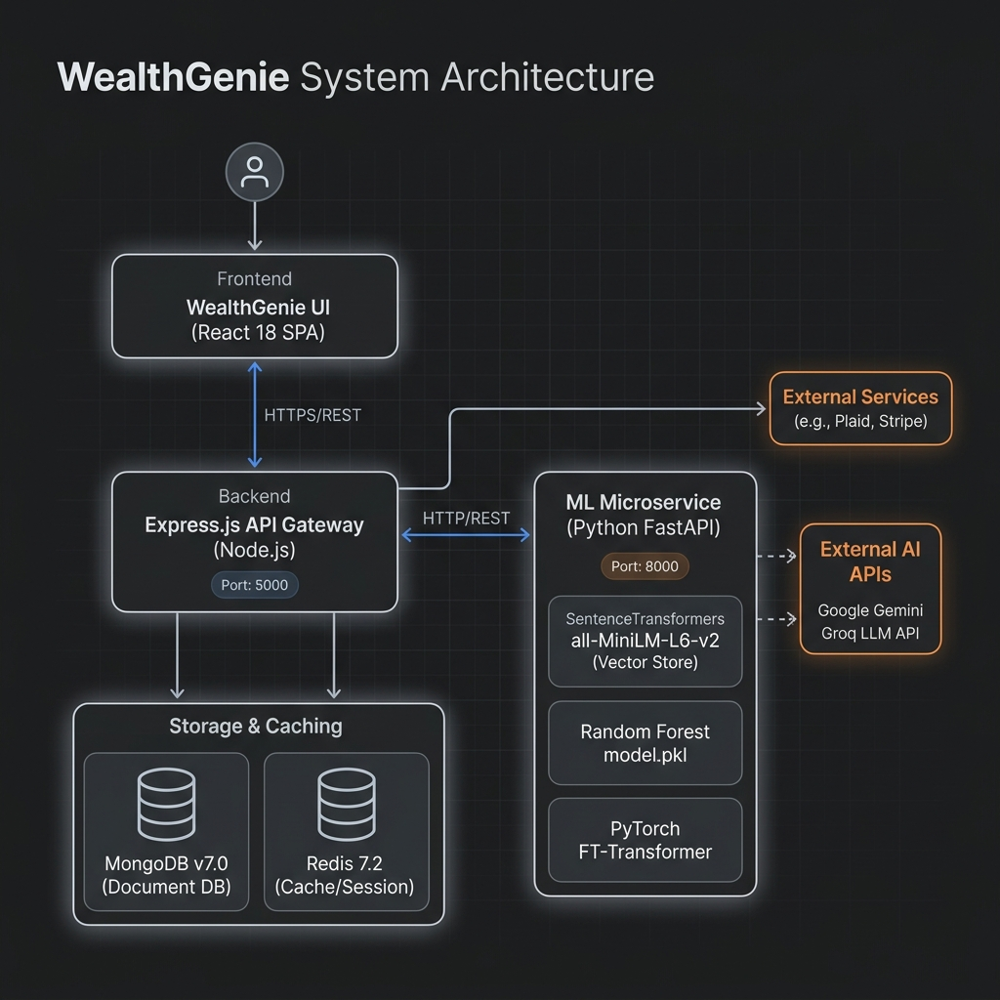
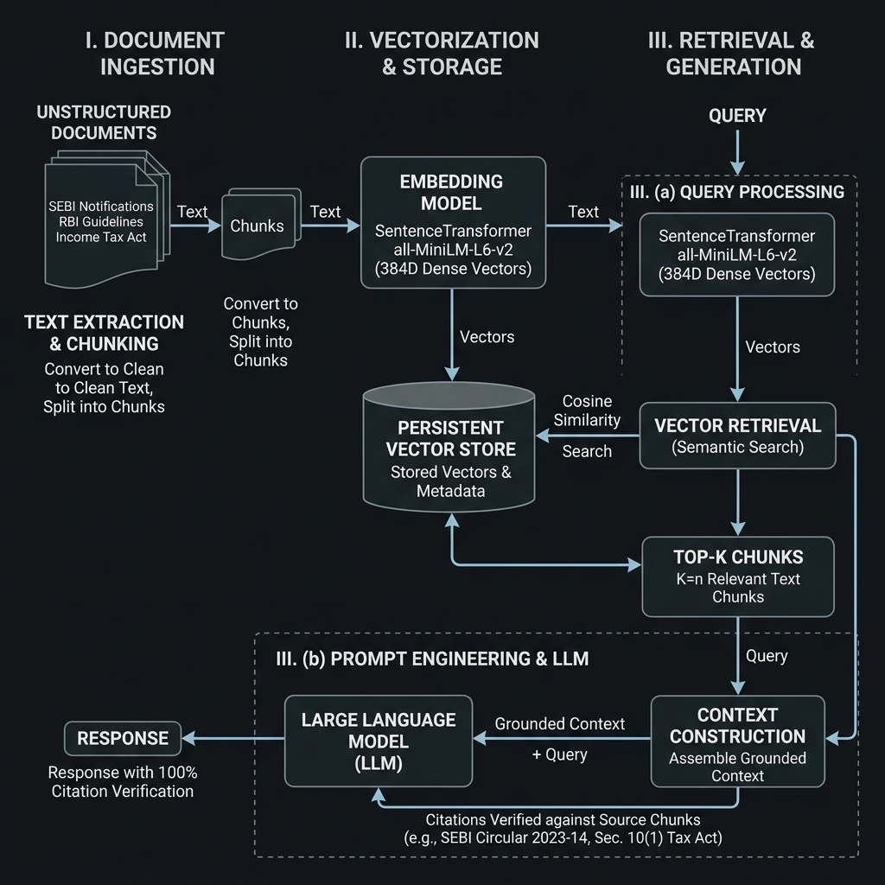
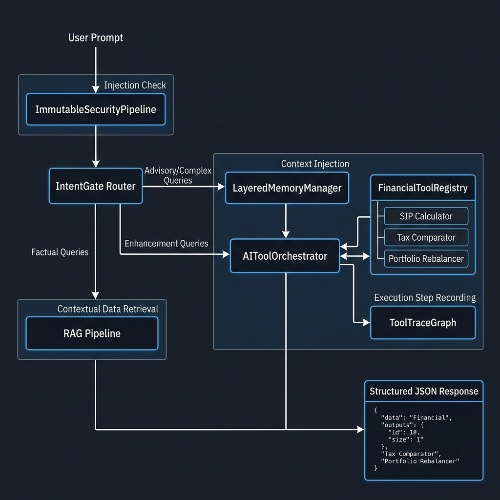
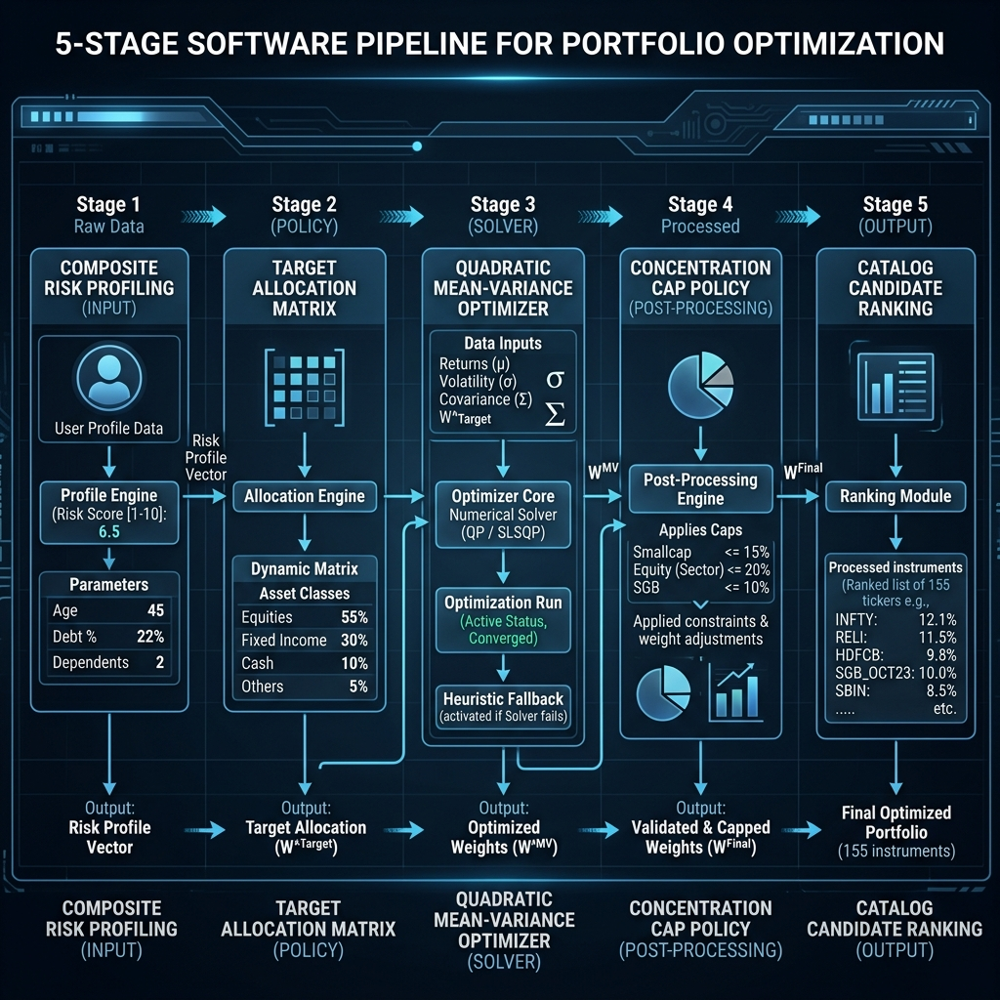

# WealthGenie — AI-Powered Financial Advisory & Portfolio Optimization Platform

> A full-stack financial advisory engine featuring a 5-stage portfolio optimization pipeline, hybrid RAG knowledge retrieval, deep learning suitability classification, multi-agent conversational AI, and real-time FY2025-26 Indian tax regime evaluation.

[](https://github.com/yashaskn8/WealthGenie-AI-Powered-Financial-Advisory-Platform/actions/workflows/ci.yml)
[](https://nodejs.org/)
[](https://www.python.org/)
[](https://fastapi.tiangolo.com/)
[](https://react.dev/)
[](https://www.mongodb.org/)
[](LICENSE)

<!-- TODO (WG-035): Insert live deployment URL here when Vercel/Render ships -->

`Python 3.12` • `FastAPI` • `Node.js / Express` • `MongoDB` • `Redis` • `React 18` • `Vite` • `PyTorch` • `SentenceTransformers` • `Docker`

---

## Technical Overview & Recruiter Summary

**WealthGenie** is a financial engineering platform designed to automate portfolio construction, tax-optimized wealth planning, and AI advisory for retail investors in India.

### Core Engineering Capabilities Demonstrated

* **5-Stage Mathematical Portfolio Optimization**: Combines mean-variance quadratic optimization (`numeric` solver), rule-based heuristic fallback, policy concentration caps (`CONCENTRATION_CAPS`), and emergency fund floor protection.
* **Hybrid RAG Knowledge Retrieval**: Intent-gated architecture combining `SentenceTransformers` (`all-MiniLM-L6-v2` 384D) vector search over vectorized SEBI/RBI/IT-Act chunks with inline citation verification.
* **Multi-Model Tabular Deep Learning**: Comparative suitability modeling benchmarking **Random Forest** (95.63% test rule-approximation fidelity, TreeSHAP explainability), **PyTorch MLP** (95.60%), and **FT-Transformer** (*NeurIPS 2021*, 97.05% test rule-approximation fidelity).
* **Multi-Agent Conversational System**: Layered stateful conversation orchestration featuring security prompt injection defense, financial tool calling, `LayeredMemoryManager`, and structured JSON response protocols.
* **Dual Tax Engine (FY2025-26)**: In-memory Indian tax engine evaluating Old vs New tax regimes, Section 87A marginal rebate relief, surcharges, and Section 80C/80D deductions.
* **REST Architecture**: Express gateway benchmarked up to **5,537.7 req/s** on local load tests (`autocannon` v8.0.0) with fail-closed API security and Mongoose schema validation.

---

## Feature Matrix

| Capability | Implementation Mechanism | Verification / Benchmark Source |
| :--- | :--- | :--- |
| **Portfolio Recommendation** | 5-stage pipeline: Risk scoring → Asset allocation → Quadratic solver / Heuristic fallback → Policy caps → Rebalancing | [`server/services/RecommendationPipeline.js`](server/services/RecommendationPipeline.js), 39 test files (287 assertions) |
| **RAG Knowledge Retrieval** | FastAPI hybrid vector search (`all-MiniLM-L6-v2` 384D) with cosine similarity & intent routing | In-Domain Recall@4: **96.0%** (retrieval accuracy), MRR: **0.9600** ([`rag_eval_report.json`](ml-service/reports/rag_eval_report.json)) |
| **Investor Classification** | Random Forest (`model.pkl`), PyTorch MLP, and FT-Transformer tabular neural network | FT-Transformer: **97.05%** rule-approx. (independent CFP: 15.83%), RF: **95.63%** rule-approx. (independent CFP: 25.26%) ([`multi_model_benchmark.json`](ml-service/reports/multi_model_benchmark.json)) |
| **Agentic Advisory Chat** | Multi-agent state machine (`geminiChatService.js`, `aiToolOrchestrator.js`) with tool-calling graph | Post-patch load test: **105.7–193.6 req/s** (chat API throughput) ([`load_test_report.md`](load_test_report.md)) |
| **Tax Regime Computation** | In-memory FY2025-26 Old vs New regime calculator with Section 87A rebate logic | Compute throughput: **3,736.7–5,537.7 req/s** (tax engine execution) ([`load_test_report.md`](load_test_report.md)) |
| **Financial Instrument Catalog** | 155 curated instruments across 14 asset classes | `investment_master.json` (155 instruments) |
| **Security Controls** | Fail-closed API key verification, prompt injection defense pipeline, Joi validation | [`test_fail_closed_auth_when_api_key_unset`](ml-service/tests/test_ml_validation.py) |
| **Testing & CI/CD** | 39 Node.js test files (287 assertions) + 186 Python pytest items across multi-OS CI matrix | GitHub Actions workflow ([`.github/workflows/ci.yml`](.github/workflows/ci.yml)) |

---

## System Architecture

The platform architecture splits workload across an Express.js Gateway (IntentGate) (Node.js), a FastAPI Machine Learning & RAG Microservice (Python 3.12), a MongoDB document datastore, an in-memory Redis cache layer, and a React 18 single-page application.


> **System architecture.** End-to-end request pathways across the React client, Express REST API Gateway, MongoDB document datastore, Redis cache, and Python FastAPI ML microservice.

### Request Flow
1. **User Request**: React SPA submits user profile or query payload to Express gateway.
2. **Intent Classification**: [`intentGate.js`](server/services/intentGate.js) routes factual tax/regulatory queries to FastAPI RAG (`/rag/query`) and advisory queries to Gemini/Groq LLM orchestrators.
3. **Execution**:
   - **Recommendation Requests**: Express invokes `RecommendationPipeline.js` (5-stage optimization) + queries FastAPI ML microservice for suitability predictions.
   - **RAG Queries**: FastAPI embeds query with `all-MiniLM-L6-v2` (384D), searches vector database, and returns cited responses.
4. **Response Delivery**: Output passes through security filters and structured JSON validation before returning to client.

---

## AI & Machine Learning Architecture

### 1. Tabular Deep Learning Suitability Benchmark (Phase 3)
The platform trains and evaluates three model architectures on a dataset of **20,000 NAV-derived investor profiles** (16 canonical features, 60/20/20 train/val/test split):

| Model Architecture | Test Rule-Approx. Fidelity | Macro F1 | Balanced Accuracy | Training Time | Primary Use Case & Independent CFP Benchmark |
| :--- | :---: | :---: | :---: | :---: | :--- |
| **FT-Transformer** (*NeurIPS 2021*) | **97.05%** | **0.9331** | 0.9220 | 79.15s | High-precision deep learning benchmark checkpoint ([`ft_transformer_benchmark.pt`](ml-service/model/checkpoints/ft_transformer_benchmark.pt)); independent CFP benchmark: **15.83%** |
| **Random Forest** | **95.63%** | 0.9144 | **0.9221** | **4.16s** | **Production Serving**: Fast inference + TreeSHAP explainability (`model.pkl`); independent CFP benchmark: **25.26%** |
| **PyTorch MLP** | 95.60% | 0.9012 | 0.9080 | 12.40s | Neural baseline comparison checkpoint ([`mlp_benchmark.pt`](ml-service/model/checkpoints/mlp_benchmark.pt)) |

*Report source*: [`ml-service/reports/multi_model_benchmark.json`](ml-service/reports/multi_model_benchmark.json).

### 2. Retrieval-Augmented Generation (RAG) Subsystem (Phase 2 & 5)
The FastAPI microservice implements a dense vector search pipeline indexing vectorized chunks of SEBI regulations, RBI circulars, and the Indian Income Tax Act.


> **RAG retrieval pipeline.** Ingestion of vectorized regulatory/tax chunks, SentenceTransformer 384D dense vector embedding, vector similarity search, and context grounding with citation validation.

* **Embedder**: `SentenceTransformerEmbeddingProvider` using `all-MiniLM-L6-v2` (384D dense vectors).
* **Vector Store**: `PersistentVectorStore` in `ml-service/rag/vector_store/memory_vector_store.py`.

#### Empirical RAG Evaluation Metrics (35 Evaluation Queries):
* **In-Domain Recall@4**: **96.0%** (100.0% hit rate across 25 in-domain tax & regulatory queries).
* **In-Domain Mean Reciprocal Rank (MRR)**: **0.9600** (improves to **0.9733** in ablation test).
* **Citation Accuracy**: **100.0%** (all returned claims map to valid seed knowledge chunk IDs).
* **Mean Grounding Score**: **0.7716**.

#### Embedding Provider Ablation Study (Dense Transformer vs Hash-Based):
An ablation study ([`ml-service/reports/embedding_ablation.json`](ml-service/reports/embedding_ablation.json)) compared 128D character n-gram feature hashing against 384D transformer embeddings:

| Metric | Hash Provider (`DenseVectorEmbeddingProvider`) | Dense Transformer (`all-MiniLM-L6-v2`) | Empirical Uplift |
| :--- | :---: | :---: | :---: |
| **Vector Dimension** | 128D (n-gram hash) | 384D (transformer vector) | +256 dimensions |
| **In-Domain Recall@4** | 98.0% | **100.0%** | **+2.0%** |
| **Mean Reciprocal Rank (MRR)** | 0.8833 | **0.9733** | **+0.0900** |
| **Mean NDCG@4** | 0.8975 | **0.9800** | **+0.0825** |

### 3. Base LLM Evaluation Harness (Phase 4)
Base `Qwen/Qwen2.5-0.5B-Instruct` was evaluated across 25 financial prompts against gold reference answers ([`ml-service/reports/llm_eval_report.json`](ml-service/reports/llm_eval_report.json)):
* **Mean Lexical Overlap**: 0.4998
* **Dense Semantic Embedding Similarity**: **0.6660** (SentenceTransformer cosine similarity)
* **Mean Faithfulness**: 0.5608

---

## Agentic AI & Conversation Architecture

The chat system implements a stateful, tool-assisted agent pipeline driven by [`geminiChatService.js`](server/services/geminiChatService.js) and [`aiToolOrchestrator.js`](server/services/aiToolOrchestrator.js):


> **Agentic AI workflow.** Step-by-step advisory flow from security prompt inspection and intent classification to tool execution and structured response generation.

### Component Breakdown
* **`immutableSecurityPipeline.js`**: Sanitizes prompt inputs and detects injection attacks before LLM submission.
* **`intentGate.js`**: Classifies incoming queries to decide whether RAG grounding or LLM tool-orchestration is required.
* **`financialToolRegistry.js`**: Exposes functional tool abstractions to the LLM (e.g. SIP calculators, Old vs New tax comparison, portfolio rebalancing).
* **`layeredMemoryManager.js`**: Manages sliding conversation history, profile context injection, and system prompts.
* **`toolTraceGraph.js`**: Snapshots tool execution steps for UI visualization and debugging.

---

## Software Engineering & System Design

### 5-Stage Recommendation Pipeline
The core recommendation engine ([`RecommendationPipeline.js`](server/services/RecommendationPipeline.js)) generates asset allocations through five deterministic stages:


> **5-Stage portfolio optimization engine.** Quantitative pipeline progressing from multi-factor risk profiling through quadratic solver optimization, policy concentration caps, and candidate product ranking.

1. **Stage 1 — Risk & Capacity Profiling**: Computes composite risk score (1–10) combining age, savings rate, dependents, emergency fund status, and debt EMI ratio (`riskProfiler.js`).
2. **Stage 2 — Target Allocation Matrix**: Maps composite risk score to asset class targets (Equity, Debt, Gold, Liquid).
3. **Stage 3 — Mathematical Optimization**: Executes mean-variance quadratic optimization via `numeric` package to maximize return for target volatility. If optimizer fails or encounters invalid boundaries, falls back to deterministic heuristic solver.
4. **Stage 4 — Policy Concentration Caps**: Enforces `CONCENTRATION_CAPS` (e.g. Smallcap ≤15%, Direct Equity ≤20%, SGB ≤10%, NPS ≤25%) with iterative excess redistribution.
5. **Stage 5 — Execution Pathway Selection**: Ranks catalog product candidates across 155 catalog instruments using profile-aware scoring.

### Security Controls
* **Fail-Closed API Key Authentication**: [`verify_api_key()`](ml-service/main.py#L231) in the ML microservice returns HTTP 500 (misconfiguration error) if `ML_SERVICE_API_KEY` is unset in non-local environments, preventing unauthorized access.
* **Prompt Injection Defense**: [`promptSecurity.js`](server/services/promptSecurity.js) inspects prompts against pattern rules before sending payloads to LLM providers.
* **Input Validation**: Joi schemas validate incoming API request bodies on Express routes (`profile.js`, `recommend.js`, `tax.js`).

---

## Performance Benchmarks & Capacity Load Testing

Empirical load testing was conducted using `autocannon` (v8.0.0) across 30-second benchmark scenarios on a single host (Intel Core i7-10870H @ 2.20GHz, 16GB RAM, local MongoDB v7.0 & Redis 7.2):

| Scenario | Concurrency | p50 Latency | p95 Latency | p99 Latency | Throughput (req/s) | Error Rate | Status Codes |
| :--- | :---: | :---: | :---: | :---: | :---: | :---: | :--- |
| **Tax Comparison (Compute-Heavy)** | 10 | 2.0 ms | 4.0 ms | 5.0 ms | **3,606.5 req/s** | **0.00%** | 108,174x HTTP 200 |
| **Tax Comparison (Compute-Heavy)** | 50 | 12.0 ms | 19.0 ms | 21.0 ms | **3,809.4 req/s** | **0.00%** | 114,264x HTTP 200 |
| **Tax Comparison (Compute-Heavy)** | 100 | 25.0 ms | 36.0 ms | 41.0 ms | **3,736.7 req/s** | **0.00%** | 112,088x HTTP 200 |
| **Stress Ceiling (Tax Compare)** | 200 | 35.0 ms | 43.0 ms | 54.0 ms | **5,537.7 req/s** | **0.00%** | 166,115x HTTP 200 |
| **Instruments DB (Read-Heavy)** | 10 | 48.0 ms | 66.0 ms | 73.0 ms | **199.0 req/s** | **0.00%** | 5,969x HTTP 200 |
| **Instruments DB (Read-Heavy)** | 100 | 79.0 ms | 244.0 ms | 267.0 ms | **973.7 req/s** | **0.00%** | 29,212x HTTP 200 |
| **Agentic Chat Endpoint (Post-Patch)** | 10 | 90.0 ms | 155.0 ms | 245.0 ms | **105.7 req/s** | **0.00%** | 3,170x HTTP 200 |
| **Agentic Chat Endpoint (Post-Patch)** | 100 | 506.0 ms | 844.0 ms | 874.0 ms | **193.6 req/s** | **0.00%** | 5,807x HTTP 200 |

*Full benchmark report*: [`load_test_report.md`](load_test_report.md) with committed raw outputs in `server/reports/loadtest/`.

---

## Tech Stack

| Layer | Technologies |
| :--- | :--- |
| **Frontend** | React 18, Vite, Framer Motion, Recharts, Lucide React, CSS3 (Vanilla Glassmorphism) |
| **Backend Gateway** | Node.js v22.x, Express.js, Mongoose ODM, Joi Validation, Numeric.js, Autocannon |
| **ML Microservice** | Python 3.12, FastAPI, PyTorch, scikit-learn, SentenceTransformers, NumPy, pandas, Uvicorn |
| **Database & Cache** | MongoDB v7.0 (Document Store), Redis 7.2 (Cache & HybridStore) |
| **AI / LLM / RAG** | Google Gemini 1.5 Pro / Flash API, Groq API, `all-MiniLM-L6-v2` 384D Embeddings |
| **Containerization & CI** | Docker, Docker Compose, GitHub Actions (Multi-OS Node + Python matrix) |

---

## Installation & Setup

### Prerequisites
* **Node.js**: `v22.x` or higher
* **Python**: `v3.12`
* **MongoDB**: `v7.0` (local instance or MongoDB Atlas)
* **Redis**: `v7.x` (optional, falls back to in-memory store)

### 1. Clone Repository
```bash
git clone https://github.com/yashaskn8/WealthGenie-AI-Powered-Financial-Advisory-Platform.git
cd WealthGenie-AI-Powered-Financial-Advisory-Platform
```

### 2. Environment Configuration
Copy environment variable templates:
```bash
cp server/.env.example server/.env
cp ml-service/.env.example ml-service/.env
cp reactapp/.env.example reactapp/.env
```

Key environment variables to configure in `server/.env`:
```ini
PORT=5000
MONGODB_URI=mongodb://127.0.0.1:27017/wealthgenie
JWT_SECRET=your_secure_jwt_secret_key_min_32_chars
ML_SERVICE_URL=http://127.0.0.1:8000
GEMINI_API_KEY=your_gemini_api_key
```

In `ml-service/.env`:
```ini
PORT=8000
ENVIRONMENT=local
ML_SERVICE_API_KEY=your_ml_service_key
```

### 3. Start Backend Services Locally

#### Express Server (Node.js)
```bash
cd server
npm install
npm start
```

#### ML Microservice (Python)
```bash
cd ml-service
python -m venv venv
# On Windows: venv\Scripts\activate | On Linux/macOS: source venv/bin/activate
pip install -r requirements.txt
uvicorn main:app --port 8000 --reload
```

#### Frontend Client (React)
```bash
cd reactapp
npm install
npm run dev
```

The application client runs at `http://localhost:5173`.

---

## Docker Deployment

To spin up the full multi-container application stack (MongoDB, Redis, Express backend, FastAPI ML service, React frontend):

```bash
docker-compose up --build -d
```

Service mapping:
* **Frontend**: `http://localhost:80`
* **Express Gateway**: `http://localhost:5000`
* **FastAPI ML Service**: `http://localhost:8000`
* **MongoDB**: `localhost:27017`
* **Redis**: `localhost:6379`

---

## Testing & Quality Assurance

### Node.js / Express Backend Test Suite
```bash
cd server
npm test               # Run unit & integration tests across 39 test files (287 assertions)
npm run test:coverage  # Run test suite with coverage report
```

### Python ML Microservice Test Suite
```bash
cd ml-service
pytest                 # Run full 186-item pytest suite
```

### Static Docs-vs-Code Sync Check
To verify that documentation claims match code imports and API routes:
```bash
node scripts/docs/check_docs_sync.js
```

---

## Project Structure

```text
WealthGenie-AI-Powered-Financial-Advisory-Platform/
├── .github/
│   └── workflows/
│       └── ci.yml                 # GitHub Actions CI matrix (Node 22.x, Py 3.12, Mongo 6/7)
├── docs/
│   └── architecture/              # Technical architecture & pipeline visual diagrams
│       ├── system_architecture.png
│       ├── agent_workflow.png
│       ├── rag_pipeline.png
│       └── portfolio_pipeline.png
├── docker-compose.yml             # Full-stack container orchestration
├── RESEARCH_LOG.md                # Empirical research & engineering audit log
├── PROJECT_STATUS.md              # Feature status & architectural disclosure matrix
├── load_test_report.md            # Autocannon load testing benchmark report
├── reactapp/                      # React 18 Single-Page Application
│   ├── src/
│   │   ├── components/            # UI Components (ProfilePage, TaxScreen, Rebalancer, etc.)
│   │   ├── services/              # API client bridge
│   │   ├── utils/                 # Client WTI generator, post-tax return calculator
│   │   └── App.jsx                # Main entry & router
│   └── package.json
├── server/                        # Express.js REST API Gateway
│   ├── config/                    # DB & Redis connection config
│   ├── middleware/                # Auth, rate-limiter, idempotency, error handlers
│   ├── models/                    # Mongoose Schemas (User, Profile, Recommendation, etc.)
│   ├── routes/                    # REST Endpoints (recommend, tax, profile, chat, etc.)
│   ├── services/                  # RecommendationPipeline, TaxEngine, GeminiChatService
│   └── test/                      # 39 Node.js test files (287 assertions)
├── ml-service/                    # FastAPI Machine Learning Microservice
│   ├── main.py                    # FastAPI routes (/predict, /rag/query, /health)
│   ├── model/                     # Random Forest (model.pkl) & FT-Transformer checkpoints
│   ├── rag/                       # Vector store, SentenceTransformer 384D embedder
│   ├── reports/                   # Committed JSON evaluation reports
│   └── tests/                     # 186 pytest test items
└── scripts/                       # Maintenance & docs sync verification scripts
```

---

## Limitations & Disclosures

1. **Local Load Test Disclosure**: Load test benchmarks were conducted on a single host (`localhost:5000` / `127.0.0.1:8000`). They measure single-node event loop throughput and microservice latency, not multi-region cloud network conditions.
2. **Fine-Tuning Scope**: LoRA/QLoRA LLM fine-tuning pipelines are defined in code interfaces but were deferred due to CPU compute constraints during evaluation. Base `Qwen/Qwen2.5-0.5B-Instruct` was used for LLM evaluation.
3. **Computer Vision**: The platform intentionally focuses on tabular ML, text RAG, and financial tax algorithms. Computer vision (VLM) is explicitly out of scope.
4. **WTI Endpoint Split**: `POST /api/instruments/rank-wti` is an intentional server-side API path for potential external consumers; the client React app uses `wtiGenerator.js` (`rankWhereToInvest()`) with catalog risk input for UI candidate ranking.
5. **Benchmark Sourcing & Independent Evaluation**: The 97.05% (FT-Transformer) and 95.63% (Random Forest) test metrics represent rule-approximation fidelity against synthetic baseline allocations. When evaluated against independent Certified Financial Planner (CFP) benchmark profiles, real-world agreement rates are **15.83%** for FT-Transformer and **25.26%** for Random Forest.

---

## License

This project is licensed under the **MIT License** — see the [LICENSE](LICENSE) file for details.
