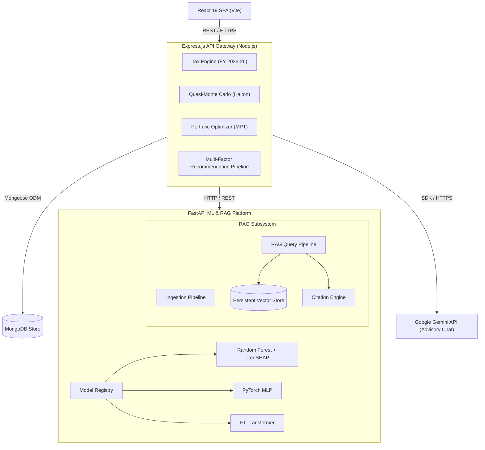
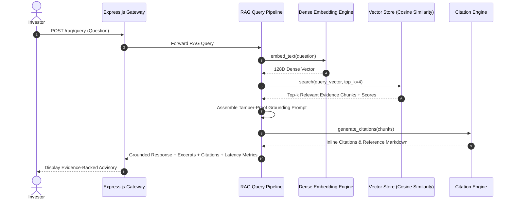

# WealthGenie

[](https://react.dev/)
[](https://expressjs.com/)
[](https://fastapi.tiangolo.com/)
[](https://pytorch.org/)
[](https://github.com/yashaskn8/deploy-wealthgenie)
[](LICENSE)

A decoupled, full-stack financial advisory and wealth management platform built for Indian retail investors. **WealthGenie** combines multi-factor asset scoring, stochastic Quasi-Monte Carlo wealth projection, Markowitz modern portfolio theory, progressive tax optimization under Indian FY 2025-26 rules, a production-grade ML platform (Random Forest, PyTorch MLP, FT-Transformer), and a production **Retrieval-Augmented Generation (RAG)** platform that grounds advisory AI in authoritative financial evidence with source citations.

---

## 🏛 System Architecture

WealthGenie uses a decoupled three-tier microservice architecture to separate user interaction, core financial computation, machine learning inference, and RAG knowledge retrieval.



---

## 📚 RAG Subsystem Architecture & Workflow

The RAG platform retrieves authoritative financial context (Income Tax Acts, SEBI/AMFI guidelines) to ground AI advisory responses and prevent hallucinations.



---

## ⚡ Core Computational & AI Engines

### 1. Production RAG Subsystem (FastAPI)
- **Ingestion Pipeline**: Ingests Markdown, Text, HTML, CSV, and PDF documents. Executes `Loader → Cleaner → Chunker → Embedding Provider → Vector Store`.
- **Configurable Chunking**: Strategy abstraction supporting `FixedSizeChunker` (sliding window overlap) and `RecursiveCharacterChunker` (hierarchical paragraph/sentence splitting).
- **Embedding Cache & Provider**: `DenseVectorEmbeddingProvider` with $L_2$-normalized subword hashing and `EmbeddingCache` for SHA256 disk/memory caching.
- **Persistent Vector Store**: `PersistentVectorStore` executing Cosine Similarity search over dense vector matrices with disk persistence.
- **Prompt Builder & Citation Engine**: Assembles strict grounding prompts and formats inline `[1]`, `[2]` source citations with metadata.

### 2. Dual-Model Machine Learning Engine (FastAPI)
- **Scikit-Learn Random Forest**: Risk profile classifier with TreeSHAP explainability.
- **PyTorch MLP**: Multi-Layer Perceptron (`Linear → BatchNorm1d → ReLU → Dropout`) with AdamW, ReduceLROnPlateau, gradient clipping, and AMP.
- **PyTorch FT-Transformer**: Feature Tokenizer Transformer (*NeurIPS 2021*) for tabular deep learning.
- **Model Registry**: Dynamic registration and lookup via `ModelRegistry`.

### 3. Progressive Tax Engine (Indian FY 2025-26)
Calculates exact tax liabilities under both the Old and New Tax Regimes, Section 87A rebate cliffs (up to ₹12L New Regime), and Section 80C/80D/80CCD(2) deductions.

---

## 🛠 Technology Stack

| Tier | Technology | Purpose |
| :--- | :--- | :--- |
| **Frontend** | React 19, Vite, Vanilla CSS | Responsive UI, interactive charts, and real-time calculation dashboards |
| **Backend API** | Node.js, Express.js, Mongoose | API Routing, financial math engines, session management |
| **Database** | MongoDB | Document store for user profiles, portfolio snapshots, and investment catalogs |
| **ML & RAG Platform** | Python 3.12, FastAPI, PyTorch, Scikit-Learn, SHAP | ModelRegistry, FT-Transformer, RAG Vector Store, Citation Engine |
| **Testing** | Node.js Test Runner, Vitest, Pytest | Multi-tier test suites across unit, integration, ML, and RAG components |

---

## 📁 Repository Organization

```
deploy-wealthgenie/
├── reactapp/                   # Frontend React Single Page Application
├── server/                     # Backend Express.js REST API
├── ml-service/                 # FastAPI Machine Learning & RAG Platform
│   ├── model/                  # ML modules (ModelRegistry, MLP, FT-Transformer, DataValidator)
│   ├── rag/                    # RAG Subsystem modules:
│   │   ├── config.py           # RAG Central Configuration
│   │   ├── schema.py           # Pydantic schemas (Document, TextChunk, Citation, RAGQuery)
│   │   ├── ingestion/          # Loaders, Cleaner, IngestionPipeline
│   │   ├── chunking/           # FixedSizeChunker & RecursiveCharacterChunker
│   │   ├── embeddings/         # DenseVectorEmbeddingProvider & EmbeddingCache
│   │   ├── vector_store/       # PersistentVectorStore (Cosine Similarity)
│   │   ├── retrieval/          # RAGPipeline retrieval & answer synthesis
│   │   ├── prompts/            # Grounding PromptBuilder
│   │   ├── citations/          # CitationEngine & Markdown formatting
│   │   ├── seed_knowledge.py   # Initial seed knowledge ingestion (Tax FY 2025-26 rules)
│   │   └── router.py           # FastAPI RAG Router (/rag/*)
│   ├── tests/                  # Pytest suite (ML validation, PyTorch, RAG pipeline)
│   ├── main.py                 # FastAPI application
│   └── requirements.txt
└── README.md
```

---

## 📡 API Endpoint Summary

| Method | Endpoint | Description |
| :--- | :--- | :--- |
| `POST` | `/rag/query` | Executes RAG vector search and returns grounded advisory answer + citations + timing metrics |
| `POST` | `/rag/index` | Ingests a new document or text snippet incrementally into RAG vector store |
| `GET` | `/rag/documents` | Lists metadata summary of all unique indexed documents in vector store |
| `GET` | `/rag/status` | Vector store index metrics, embedding parameters, and cache hit rates |
| `GET` | `/rag/health` | RAG subsystem health check |
| `POST` | `/predict` | Random Forest + TreeSHAP inference |
| `POST` | `/predict/pytorch` | PyTorch MLP inference |
| `POST` | `/predict/ft_transformer` | FT-Transformer inference |
| `POST` | `/predict/compare` | Dynamic multi-model side-by-side comparison across all models in registry |
| `GET` | `/models` | Lists registered models in ModelRegistry |
| `GET` | `/readiness` | Model readiness probe |

---

## 🧪 Testing Suite Execution

Run unit and integration test suites across all three microservices:

```bash
# 1. Backend Service Unit Tests
cd server
npm test

# 2. Frontend Vitest Suite
cd ../reactapp
npm test

# 3. ML & RAG Platform Pytest Suite
cd ../ml-service
python -m pytest tests/ -p no:phoenix -v
```

---

## 📜 License

Distributed under the MIT License. See `LICENSE` for details.
