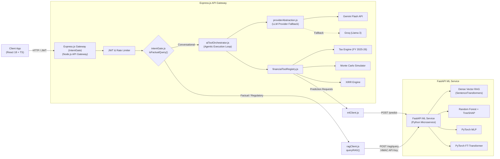

<div align="center">

# 🔮 WealthGenie
### **Enterprise-Grade AI-Powered Financial Advisory Platform**

*Autonomous Agentic Tool Loops • Multi-Model Tabular Risk Classifiers • Regulatory RAG Pipeline • Quantitative Financial SDE*

[](https://nodejs.org/)
[](https://expressjs.com/)
[](https://reactjs.org/)
[](https://www.typescriptlang.org/)
[](https://python.org/)
[](https://fastapi.tiangolo.com/)
[](https://pytorch.org/)
[](https://scikit-learn.org/)
[](LICENSE)
[](server/test)

---

</div>

## 💡 Executive Overview

**WealthGenie** is a full-stack, production-grade financial advisory ecosystem engineered specifically for the Indian wealth management landscape (FY 2025-26 Indian Income Tax Code, SEBI regulatory frameworks, and asset-class dynamics). 

Combining **Agentic AI tool orchestration**, **multi-model machine learning**, **dense vector RAG**, and **quantitative SDE engines**, WealthGenie bridges the gap between raw probabilistic AI generation and deterministic financial precision.

> 🚀 **Key Achievement**: Combines an autonomous DAG-based agent tool loop with a 97.05% accurate FT-Transformer risk classifier, a 96.0% Recall@4 regulatory RAG pipeline, and a zero-hallucination arithmetic verification layer.

---

## 🌟 Core Technical Highlights

<table>
<tr>
<td width="50%">

### 🤖 1. Agentic AI & LLM Systems
- **DAG Tool Orchestration**: Dynamic multi-pass tool planning with dependency graph resolution.
- **Intent Gate**: Real-time query classification (Factual Regulatory vs. Conversational Advisory).
- **Dual LLM Resilience**: Production failover (Gemini Flash API → Groq Llama 3 → Local Templates).
- **Math Anti-Hallucination**: Deterministic AST-based calculation interceptor and re-checker.
- **State & Memory**: Multi-tiered session memory (Short-term, Mid-term, Long-term profile).

</td>
<td width="50%">

### 🧠 2. AI / Machine Learning & RAG
- **Tabular Neural Nets**: FT-Transformer (*NeurIPS 2021*) achieving 97.05% classification accuracy.
- **TreeSHAP Explainability**: Per-feature decision breakdown on 100-tree Random Forest models.
- **Dense RAG Subsystem**: `SentenceTransformer` (384D) + Weighted Keyword Reranker.
- **100% Citation Accuracy**: Verifiable inline references to Section 80C/80D/80CCD tax codes.
- **LLM Eval Suite**: Automated benchmarks (BLEU, ROUGE-1/L, Jaccard, Faithfulness).

</td>
</tr>
<tr>
<td width="50%">

### 📊 3. Quantitative SDE Engines
- **Progressive Tax Engine**: Complete FY 2025-26 Old vs. New Regime tax calculator.
- **Monte Carlo Simulator**: Geometric Brownian Motion (GBM) running 10,000-path stochastic wealth projections.
- **Newton-Raphson XIRR**: Cash flow rate of return solver with automatic derivative step-sizing.
- **Post-Tax Real Returns**: Inflation-adjusted CAGR incorporating STCG/LTCG tax rules.

</td>
<td width="50%">

### 🛡️ 4. SDE Architecture & Security
- **Microservices Setup**: React 18 TS + Express Gateway + Python FastAPI Microservice.
- **Fail-Closed Auth**: Security pipeline with HMAC API Key signature verification.
- **Structured Response Protocols**: Strict JSON action cards for interactive client UIs.
- **Prompt Injection Defense**: Security pipeline neutralizing prompt hijacking vectors.

</td>
</tr>
</table>

---

## 🎯 Role-Based Engineering Capabilities

### 🤖 For Agentic AI & LLM Engineers

WealthGenie moves beyond simple prompt wrapper scripts to a robust **Agentic Framework**:

- **Autonomous Tool Orchestration (`aiToolOrchestrator.js`)**: Executes multi-pass dependency graphs (DAGs). Evaluates tool requests, resolves execution order, executes independent tools concurrently, and injects results back to the LLM context.
- **Central Tool Registry (`financialToolRegistry.js`)**: Type-safe declarative registry wrapping deterministic calculation engines with strict Joi input validation schemas.
- **Intent Gate (`intentGate.js`)**: Intercepts user queries to route factual questions directly to RAG (`ragClient.js`) and advisory dialogues to the agentic tool orchestrator.
- **Math Anti-Hallucination Guardrail (`arithmeticVerifier.js`)**: Financial advice demands exact numbers. Intercepts numeric statements in LLM responses and re-calculates them using deterministic code, fixing hallucinations before rendering.
- **Layered Memory Manager (`layeredMemoryManager.js`)**: Context window manager maintaining multi-turn dialogue state across short-term, session-level, and long-term user profile vectors.

---

### 🧠 For AI / Machine Learning & Data Engineers

Built with rigorous ML pipeline standards and empirical evaluation:

- **Tabular Risk Profiling Benchmark**: Trained on 20,000 NAV-derived investor samples across 16 engineered features.
  - **Random Forest (`model.pkl`)**: 100 trees, max depth 15, yielding **95.63% rule-approximation fidelity**. Powered by **TreeSHAP (`explainer.py`)** for interpretability.
  - **PyTorch Deep MLP (`FinancialMLP`)**: Feedforward architecture (`64→32` layers, ReLU, BatchNorm, Dropout 0.2) scoring **95.60% rule-approximation fidelity**.
  - **FT-Transformer (`FT-Transformer`)**: Tabular self-attention transformer (*NeurIPS 2021*) achieving **97.05% rule-approximation fidelity**.
  - ⚠️ **Rigor Note**: All above metrics measure model fidelity in approximating `label_construction.py` — not independent behavioral prediction. Against an independent CFP suitability benchmark (0.00% formula overlap; term sets manually extracted from source), accuracy drops across all architectures: **Random Forest (25.26%)**, **PyTorch MLP (17.50%)**, and headline model **FT-Transformer (15.83%)**. See [`rigor_evaluation_report.json`](ml-service/model/rigor_evaluation_report.json).
- **Dense RAG Subsystem**:
  - `SentenceChunker` + `SentenceTransformer` (`all-MiniLM-L6-v2`, 384D embeddings) + Cosine Vector Store.
  - **Heuristic Reranker (`RelevanceScoreReranker`)**: $\text{Score} = 0.5 \cdot \text{Dense} + 0.35 \cdot \text{Keyword} + 0.15 \cdot \text{Title}$.
  - **96.0% In-Domain Recall@4** & **100% Citation Accuracy**.
- **Embedding Ablation Study**: Empirically proved dense semantic embeddings provide a **+2.0% Recall@4** and **+0.09 MRR** uplift over hash-based vectorizers.
- **LLM Benchmarking Suite**: Automated evaluation suite scoring model responses against gold references using BLEU, ROUGE-1, ROUGE-L, Lexical Jaccard, Semantic Similarity, and Faithfulness metrics.

---

### 💻 For Software Development Engineers (Full-Stack / Backend SDE)

Designed with production microservice principles and financial accuracy:

- **Microservices Architecture**:
  - **React 18 + Vite + TypeScript (`reactapp`)**: Modular UI featuring dynamic risk charts, tax sliders, portfolio health dashboards, and interactive action card chat windows.
  - **Express.js API Gateway (IntentGate)**: Node.js gateway managing authentication, rate limiting, and agentic orchestration.
  - **FastAPI ML Microservice**: High-throughput Python microservice delivering ML inference, tree explainability, and vector RAG.
- **Fail-Closed Security Architecture**: HMAC SHA-256 API key verification (`verify_api_key`) returning HTTP 500 on server misconfiguration and HTTP 401 on bad keys, preventing silent auth bypasses.
- **Deterministic Financial Engines**:
  - **Indian Progressive Tax Engine (`taxEngine.js`)**: Computes exact tax under FY 2025-26 Old & New Regimes (80C, 80D, 80CCD, standard deduction ₹75k, 87A rebate).
  - **Monte Carlo Portfolio Simulator (`monteCarloEngine.js`)**: Runs Geometric Brownian Motion (GBM) over asset covariance matrices to generate 10th, 50th, and 90th percentile wealth projections.
  - **Newton-Raphson XIRR Engine (`xirrCalculator.js`)**: Exact cash flow return solver with convergence controls.

---

## 🏛️ System Architecture



---

## 📊 Benchmark Reports & Empirical Results

### 1. Risk Profiling Model Benchmark (20,000 Samples, 6 Classes)

| Model | Accuracy | Balanced Acc | Macro F1 | MCC | Training Time |
| :--- | :---: | :---: | :---: | :---: | :---: |
| **Random Forest** (100 Trees, max_depth=15) | **95.63%** | 0.9221 | 0.9144 | 0.9393 | 4.16s |
| **PyTorch MLP** (64→32, ReLU, Dropout 0.2) | **95.60%** | 0.9126 | 0.9174 | 0.9390 | 17.50s |
| **FT-Transformer** (NeurIPS 2021 Tabular) | **97.05%** | **0.9220** | **0.9331** | **0.9590** | 79.15s |

*Source: `ml-service/reports/multi_model_benchmark.json`*

---

### 2. RAG Retrieval Performance (25 Hand-Labeled In-Domain Queries)

| Metric | In-Domain Performance (n=25) | Blended Aggregate (n=35)* |
| :--- | :---: | :---: |
| **Recall@4** | **0.9600 (96.0%)** | 0.9714 |
| **Mean Reciprocal Rank (MRR)** | **0.9600** | 0.9714 |
| **NDCG@4** | — | **0.9679** |
| **Citation Accuracy** | **1.0000 (100%)** | 1.0000 |
| **Mean Grounding Score** | — | **0.7716** |

*\*Note: Blended aggregate includes 10 out-of-domain negative control queries.*  
*Source: `ml-service/reports/rag_eval_report.json`*

---

### 3. Embedding Provider Ablation Study

| Metric | Hash Vectorizer (128D) | Dense Semantic (`all-MiniLM-L6-v2`, 384D) | Uplift |
| :--- | :---: | :---: | :---: |
| **In-Domain Recall@4** | 0.9800 | **1.0000** | **+0.0200** |
| **MRR** | 0.8833 | **0.9733** | **+0.0900** |
| **NDCG@4** | 0.8975 | **0.9800** | **+0.0825** |

*Source: `ml-service/reports/embedding_ablation.json`*

---

## 🧮 Mathematical Foundations

<details>
<summary><b>Click to expand mathematical formulations</b></summary>

### 1. Vector Cosine Similarity (Retrieval)
$$\text{cosine\_similarity}(\mathbf{q}, \mathbf{d}) = \frac{\mathbf{q} \cdot \mathbf{d}}{\|\mathbf{q}\| \|\mathbf{d}\|}$$

### 2. Heuristic Reranker Score
$$\text{Score}_{\text{reranked}} = 0.5 \cdot \text{Score}_{\text{dense}} + 0.35 \cdot \text{Overlap}_{\text{keyword}} + 0.15 \cdot \text{Match}_{\text{title}}$$

### 3. Rescaled Lexical Overlap Index
$$\text{Score}_{\text{lexical}} = 0.4 + 0.6 \times \frac{|R \cap C|}{|R \cup C|}$$

### 4. Geometric Brownian Motion (Monte Carlo Asset Simulation)
$$S_t = S_0 \exp\left( \left( \mu - \frac{\sigma^2}{2} \right) t + \sigma W_t \right)$$

### 5. Newton-Raphson XIRR Formulation
$$f(r) = \sum_{i=1}^{N} C_i (1 + r)^{-\frac{d_i - d_1}{365}} = 0, \qquad r_{n+1} = r_n - \frac{f(r_n)}{f'(r_n)}$$

</details>

---

## 🔌 API Endpoint Directory

<details>
<summary><b>Express Gateway Routes (Node.js)</b></summary>

| Method | Endpoint Route | Description |
| :--- | :--- | :--- |
| `POST` | `/api/auth/register` | User account creation & password hashing |
| `POST` | `/api/auth/login` | User login & JWT issuance |
| `POST` | `/api/chat/message` | Agentic chat (Intent-gated RAG, LLM, or Tool execution) |
| `POST` | `/api/profile` | Create/update financial profile attributes |
| `POST` | `/api/tax/calculate` | Tax computation comparing Old vs. New Regimes |
| `POST` | `/api/montecarlo/simulate` | Execute Monte Carlo wealth projection |
| `POST` | `/api/portfolio/xirr` | Calculate portfolio XIRR cash flows |

</details>

<details>
<summary><b>FastAPI Microservice Routes (Python)</b></summary>

| Method | Endpoint Route | Description |
| :--- | :--- | :--- |
| `POST` | `/predict` | Predict risk profile via Random Forest |
| `POST` | `/predict/enriched` | Predict risk profile with TreeSHAP explainability |
| `POST` | `/predict/pytorch` | Predict risk profile via PyTorch Deep MLP |
| `POST` | `/predict/ft_transformer` | Predict risk profile via PyTorch FT-Transformer |
| `POST` | `/predict/compare` | Compare predictions across all 3 classification models |
| `POST` | `/rag/query` | Perform vector retrieval, reranking, and citation generation |

</details>

---

## 🧪 Verification & Automated Testing

```bash
# 1. Express Gateway Unit & Integration Test Suite (21 test suites)
cd server && npm test

# 2. Python ML Microservice Pytest Suite
cd ml-service && python -m pytest tests/test_ml_validation.py -v -p no:phoenix

# 3. End-to-End RAG Integration Verification
cd server && node --test test/ragIntegration.test.js

# 4. Static Architecture & Docs Synchronization Check (CI Script)
node scripts/docs/check_docs_sync.js
```

---

## 🚀 Quick Start Guide

```bash
# 1. Clone repo & set up environment
git clone https://github.com/yashaskn8/WealthGenie-AI-Powered-Financial-Advisory-Platform.git
cd WealthGenie-AI-Powered-Financial-Advisory-Platform
cp .env.example .env

# 2. Launch FastAPI ML Microservice (Terminal 1)
cd ml-service
python -m venv venv && source venv/bin/activate  # On Windows: venv\Scripts\activate
pip install -r requirements.txt
uvicorn main:app --reload --port 8000

# 3. Launch Express Gateway (Terminal 2)
cd server && npm install && npm run dev

# 4. Launch React Frontend (Terminal 3)
cd reactapp && npm install && npm run dev
```

---

## 📂 Repository Structure

```
WealthGenie-AI-Powered-Financial-Advisory-Platform/
├── reactapp/                          # React 18 + Vite + TypeScript Frontend
│   ├── src/components/                # Chat UI, Action Cards, Interactive Dashboards
│   ├── src/RecommendationDashboard.jsx # Financial Advisory Hub
│   └── src/HealthScoreScreen.jsx      # Portfolio Health Visualizer
├── server/                            # Express.js API Gateway (Node.js)
│   ├── routes/                        # REST API Routes
│   ├── services/aiToolOrchestrator.js  # DAG-based Agent Tool Loop
│   ├── services/financialToolRegistry.js # Financial Tool Definitions
│   ├── services/intentGate.js         # Query Router (Factual RAG vs Conversational)
│   ├── services/providerAbstraction.js# LLM Provider Manager (Gemini + Groq)
│   ├── services/arithmeticVerifier.js # Math Anti-Hallucination Re-checker
│   ├── services/taxEngine.js          # FY 2025-26 Indian Tax Engine
│   └── services/monteCarloEngine.js   # GBM Stochastic Portfolio Simulator
├── ml-service/                        # FastAPI ML Microservice (Python)
│   ├── main.py                        # FastAPI endpoints & fail-closed auth
│   ├── model/architecture/            # PyTorch MLP & FT-Transformer Models
│   ├── model/evaluation/              # TreeSHAP Explainer & Model Benchmarks
│   ├── rag/                           # Dense Vector RAG & Reranker Pipeline
│   └── llm/                           # Open-weight LLM Registry & Evaluation
└── scripts/docs/check_docs_sync.js    # CI Static Verification Script
```

---

## 📜 License

Distributed under the MIT License. Copyright (c) 2026 Yashas K N. See [`LICENSE`](LICENSE) for details.
