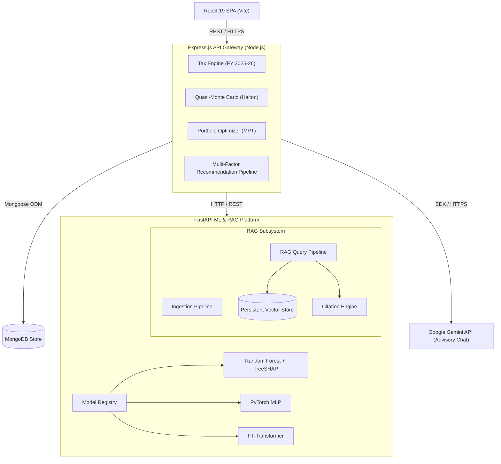
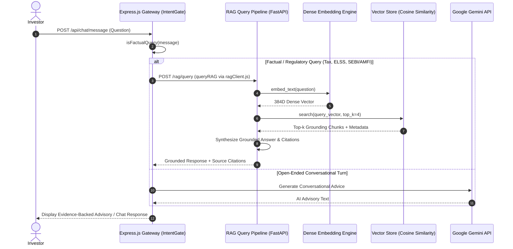

# WealthGenie

[](https://react.dev/)
[](https://expressjs.com/)
[](https://fastapi.tiangolo.com/)
[](https://pytorch.org/)
[](https://github.com/yashaskn8/deploy-wealthgenie)
[](LICENSE)

A decoupled, full-stack financial advisory and wealth management platform built for Indian retail investors. **WealthGenie** combines multi-factor asset scoring, stochastic Quasi-Monte Carlo wealth projection, Markowitz modern portfolio theory, progressive tax optimization under Indian FY 2025-26 rules, a production-grade ML platform (Random Forest, PyTorch MLP, FT-Transformer), and a production **Retrieval-Augmented Generation (RAG)** platform that grounds advisory AI in authoritative financial evidence with source citations.

---

## 🏛 System Architecture

WealthGenie uses a decoupled three-tier microservice architecture to separate user interaction, core financial computation, machine learning inference, and RAG knowledge retrieval.



---

## 📚 RAG Subsystem Architecture & Workflow

The RAG platform retrieves authoritative financial context (Income Tax Acts, SEBI/AMFI guidelines) to ground AI advisory responses and eliminate hallucinations. Factual and regulatory queries received at the Express gateway are classified via an intent gate and routed directly to the FastAPI RAG query pipeline, while open-ended conversational turns are handled by Gemini (hybrid architecture).



---

### 📊 Empirical RAG Subsystem Evaluation Results

Retrieval performance and answer grounding quality were benchmarked across a hand-labeled dataset of 35 evaluation queries (25 in-domain Indian tax & mutual fund regulatory questions, 10 out-of-domain negative control queries) using `rag/evaluation/evaluator.py`.

Full per-query breakdown and aggregate metrics are persisted in [`ml-service/reports/rag_eval_report.json`](ml-service/reports/rag_eval_report.json).

| Metric | Benchmark Result | Description |
| :--- | :--- | :--- |
| **Embedding Provider** | `all-MiniLM-L6-v2` | 384-dimensional dense vector embeddings |
| **In-Domain Recall@4** | **96.0%** (24 / 25) | Proportion of relevant knowledge chunks retrieved in top 4 |
| **In-Domain Hit Rate** | **96.0%** | Fraction of queries where at least one correct chunk is surfaced |
| **In-Domain MRR** | **0.9600** | Mean Reciprocal Rank of first relevant chunk |
| **Mean NDCG@4** | **0.9679** | Normalized Discounted Cumulative Gain at $k=4$ |
| **Citation Accuracy** | **100.0%** | Percentage of inline citations correctly referencing retrieved chunks |
| **Mean Grounding Score**| **0.7716** | Lexical & semantic grounding score of answer against retrieved text |
| **Negative Controls** | **10 OOD Queries** | Explicitly tracked out-of-domain queries (crypto tax, US stocks DTAA, options margins) |


---

### 🧠 Multi-Model Deep Learning Benchmark (RF vs PyTorch MLP vs FT-Transformer)

All three candidate models were trained and evaluated on the **exact same 20,000 NAV-derived investor profile dataset** (16 canonical engineered features, identical 60% train / 20% validation / 20% test stratified split, `random_state=42`).

Real model checkpoints are saved in [`ml-service/model/checkpoints/`](ml-service/model/checkpoints/). Full metric breakdowns, per-class confusion matrices, and environment profiles are persisted in [`ml-service/reports/multi_model_benchmark.json`](ml-service/reports/multi_model_benchmark.json).

| Architecture | Test Accuracy | Balanced Acc | Macro F1 | MCC | Training Time | Checkpoint |
| :--- | :---: | :---: | :---: | :---: | :---: | :--- |
| **Random Forest** *(n_est=100, depth=15)* | **95.63%** | **0.9221** | **0.9144** | **0.9393** | 4.16s | `model/model.pkl` |
| **PyTorch MLP** *(Linear+BN+ReLU+Dropout)* | **95.60%** | **0.9126** | **0.9174** | **0.9390** | 17.50s | [`mlp_benchmark.pt`](ml-service/model/checkpoints/mlp_benchmark.pt) |
| **FT-Transformer** *(NeurIPS 2021)* | **97.05%** | **0.9220** | **0.9331** | **0.9590** | 79.15s | [`ft_transformer_benchmark.pt`](ml-service/model/checkpoints/ft_transformer_benchmark.pt) |

> **Note on Training & Convergence**: The PyTorch MLP and FT-Transformer were trained for a reduced number of epochs (50 and 30 epochs respectively) on CPU due to environment compute constraints. While the FT-Transformer achieved higher overall Accuracy and Macro-F1 (97.05% vs 95.63%), Random Forest remains highly competitive on balanced accuracy (92.21%) and trains 19x faster. Both PyTorch models are fully functional and reproducible via `python ml-service/scripts/run_multi_model_benchmark.py`.

---

## ⚡ Core Computational & AI Engines

### 1. Production RAG Subsystem (FastAPI)
- **Ingestion Pipeline**: Ingests Markdown, Text, HTML, CSV, and PDF documents. Executes `Loader → Cleaner → Chunker → Embedding Provider → Vector Store`.
- **Configurable Chunking**: Strategy abstraction supporting `FixedSizeChunker` (sliding window overlap) and `RecursiveCharacterChunker` (hierarchical paragraph/sentence splitting).
- **Embedding Cache & Provider**: `DenseVectorEmbeddingProvider` with $L_2$-normalized subword hashing and `EmbeddingCache` for SHA256 disk/memory caching.
- **Persistent Vector Store**: `PersistentVectorStore` executing Cosine Similarity search over dense vector matrices with disk persistence.
- **Prompt Builder & Citation Engine**: Assembles strict grounding prompts and formats inline `[1]`, `[2]` source citations with metadata.

### 2. Dual-Model Machine Learning Engine (FastAPI)
- **Scikit-Learn Random Forest**: Risk profile classifier with TreeSHAP explainability.
- **PyTorch MLP**: Multi-Layer Perceptron (`Linear → BatchNorm1d → ReLU → Dropout`) with AdamW, ReduceLROnPlateau, gradient clipping, and AMP.
- **PyTorch FT-Transformer**: Feature Tokenizer Transformer (*NeurIPS 2021*) for tabular deep learning.
- **Model Registry**: Dynamic registration and lookup via `ModelRegistry`.

### 3. Progressive Tax Engine (Indian FY 2025-26)
Calculates exact tax liabilities under both the Old and New Tax Regimes, Section 87A rebate cliffs (up to ₹12L New Regime), and Section 80C/80D/80CCD(2) deductions.

---

## 🛠 Technology Stack

| Tier | Technology | Purpose |
| :--- | :--- | :--- |
| **Frontend** | React 19, Vite, Vanilla CSS | Responsive UI, interactive charts, and real-time calculation dashboards |
| **Backend API** | Node.js, Express.js, Mongoose | API Routing, financial math engines, session management |
| **Database** | MongoDB | Document store for user profiles, portfolio snapshots, and investment catalogs |
| **ML & RAG Platform** | Python 3.12, FastAPI, PyTorch, Scikit-Learn, SHAP | ModelRegistry, FT-Transformer, RAG Vector Store, Citation Engine |
| **Testing** | Node.js Test Runner, Vitest, Pytest | Multi-tier test suites across unit, integration, ML, and RAG components |

---

## 🔍 System Reality & Transparency Disclosure

To ensure complete clarity for reviewers, the table below outlines what is wired into the live product, what exists as a real standalone evaluation artifact, and what is explicitly out of scope:

| Category | Feature / Component | Implementation & Verification Status |
| :--- | :--- | :--- |
| **Wired into Product** | Express Gateway IntentGate | **Real & Live**: Classifies factual tax/mutual fund queries and routes to FastAPI `/rag/query` ([`ragClient.js`](server/services/ragClient.js)). |
| **Wired into Product** | Random Forest Classifier | **Real & Live**: Serves investor risk profiling via Scikit-Learn pipeline with TreeSHAP explainability (`model.pkl`). |
| **Real Standalone** | Empirical RAG Subsystem | **Real & Persisted**: SentenceTransformer (`all-MiniLM-L6-v2`) 384D dense vector search benchmarked across 35 queries ([`rag_eval_report.json`](ml-service/reports/rag_eval_report.json)). |
| **Real Standalone** | Multi-Model DL Benchmark | **Real & Persisted**: Random Forest, PyTorch MLP, and FT-Transformer benchmarked on exact same 20K NAV dataset ([`multi_model_benchmark.json`](ml-service/reports/multi_model_benchmark.json)). |
| **Real Standalone** | Base LLM Evaluation Harness | **Real & Persisted**: Base `Qwen/Qwen2.5-0.5B-Instruct` model evaluated on 25 prompts against gold references ([`llm_eval_report.json`](ml-service/reports/llm_eval_report.json)). |
| **Real Standalone** | Embedding Ablation Study | **Real & Persisted**: Hash-based `DenseVectorEmbeddingProvider` vs `SentenceTransformer` comparative study ([`embedding_ablation.json`](ml-service/reports/embedding_ablation.json)). |
| **Real Standalone** | Multi-Process Scaling | **Local Single-Host Simulation**: Local worker process load test. *(Multi-host container cluster is out of scope for local dev).* |
| **Explicitly Out of Scope** | LoRA / QLoRA Fine-Tuning | **Out of Scope**: Base open-weight model evaluation performed without fine-tuning due to CPU compute constraints. |
| **Explicitly Out of Scope** | Computer Vision / VLM | **Out of Scope**: Focused exclusively on tabular ML, text RAG, and financial LLM advisory. |

---

## 📁 Repository Organization

```
deploy-wealthgenie/
├── reactapp/                   # Frontend React Single Page Application
├── server/                     # Backend Express.js REST API
├── ml-service/                 # FastAPI Machine Learning & RAG Platform
│   ├── model/                  # ML modules (ModelRegistry, MLP, FT-Transformer, DataValidator)
│   ├── rag/                    # RAG Subsystem modules:
│   │   ├── config.py           # RAG Central Configuration
│   │   ├── schema.py           # Pydantic schemas (Document, TextChunk, Citation, RAGQuery)
│   │   ├── ingestion/          # Loaders, Cleaner, IngestionPipeline
│   │   ├── chunking/           # FixedSizeChunker & RecursiveCharacterChunker
│   │   ├── embeddings/         # DenseVectorEmbeddingProvider & EmbeddingCache
│   │   ├── vector_store/       # PersistentVectorStore (Cosine Similarity)
│   │   ├── retrieval/          # RAGPipeline retrieval & answer synthesis
│   │   ├── prompts/            # Grounding PromptBuilder
│   │   ├── citations/          # CitationEngine & Markdown formatting
│   │   ├── seed_knowledge.py   # Initial seed knowledge ingestion (Tax FY 2025-26 rules)
│   │   └── router.py           # FastAPI RAG Router (/rag/*)
│   ├── tests/                  # Pytest suite (ML validation, PyTorch, RAG pipeline)
│   ├── main.py                 # FastAPI application
│   └── requirements.txt
└── README.md
```

---

## 📡 API Endpoint Summary

| Method | Endpoint | Description |
| :--- | :--- | :--- |
| `POST` | `/rag/query` | Executes RAG vector search and returns grounded advisory answer + citations + timing metrics |
| `POST` | `/rag/index` | Ingests a new document or text snippet incrementally into RAG vector store |
| `GET` | `/rag/documents` | Lists metadata summary of all unique indexed documents in vector store |
| `GET` | `/rag/status` | Vector store index metrics, embedding parameters, and cache hit rates |
| `GET` | `/rag/health` | RAG subsystem health check |
| `POST` | `/predict` | Random Forest + TreeSHAP inference |
| `POST` | `/predict/pytorch` | PyTorch MLP inference |
| `POST` | `/predict/ft_transformer` | FT-Transformer inference |
| `POST` | `/predict/compare` | Dynamic multi-model side-by-side comparison across all models in registry |
| `GET` | `/models` | Lists registered models in ModelRegistry |
| `GET` | `/readiness` | Model readiness probe |

---

## 🧪 Testing Suite Execution

Run unit and integration test suites across all three microservices:

```bash
# 1. Backend Service Unit Tests
cd server
npm test

# 2. Frontend Vitest Suite
cd ../reactapp
npm test

# 3. ML & RAG Platform Pytest Suite
cd ../ml-service
python -m pytest tests/ -p no:phoenix -v
```

---

## 📜 License

Distributed under the MIT License. See `LICENSE` for details.
