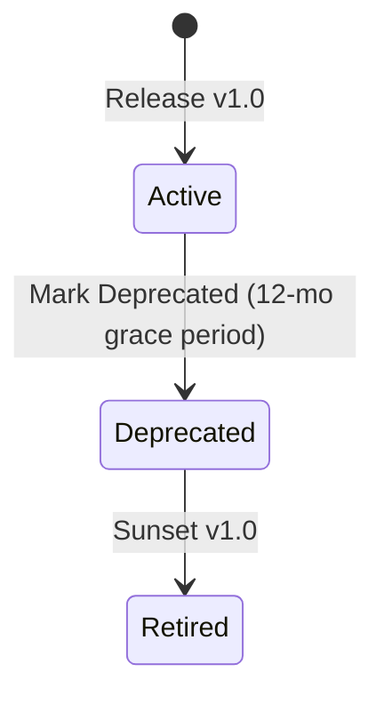

# WealthGenie API Versioning & Evolution Policy — Task 3

## Overview
WealthGenie uses URI Path Versioning for major breaking API revisions (e.g. `/api/v1/recommend`) and Header-based Content Negotiation for minor non-breaking payload evolution.

## Versioning Strategy

### 1. Major Versions (`/api/v1`, `/api/v2`)
- Introduced ONLY when breaking changes occur (e.g. removing fields, renaming endpoints, altering authentication semantics).
- Major versions are supported concurrently for a minimum **12-month deprecation window**.

### 2. Minor Non-Breaking Evolution
- Adding new optional fields to request bodies or response payloads does NOT trigger a major version bump.
- Clients MUST implement flexible JSON parsing (ignoring unknown properties).

## Deprecation Schedule & Lifecycle

1. **Header Notification**: Deprecated endpoints include `Sunset: Wed, 01 Jul 2027 00:00:00 GMT` and `Link: <https://docs.wealthgenie.io/api/v2>; rel="successor-version"` headers.
2. **Migration Guide**: Published 60 days before any major sunset.
