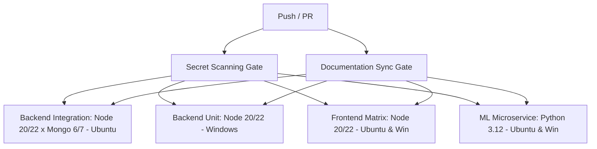

# Matrix Optimization & Pipeline Design — Task 2 & 6

## Architecture Overview

To eliminate redundant runner combinations and platform-specific container errors, the pipeline is split into dedicated single-responsibility jobs.

## Matrix Job Allocation

1. **`secret-scan-gate`**: Single job on `ubuntu-latest` running fast secret scan.
2. **`docs-sync-gate`**: Single job on `ubuntu-latest` running documentation parity check.
3. **`backend-integration-linux`**: Linux matrix (`Node 20.x, 22.x` × `MongoDB 6.0, 7.0`) running containerized real MongoDB.
4. **`backend-unit-windows`**: Windows matrix (`Node 20.x, 22.x`) using `mongodb-memory-server` without container actions.
5. **`frontend-matrix`**: Node `20.x, 22.x` on `ubuntu-latest` and `windows-latest`.
6. **`ml-microservice-quality`**: Python `3.12` on `ubuntu-latest` and `windows-latest`.
