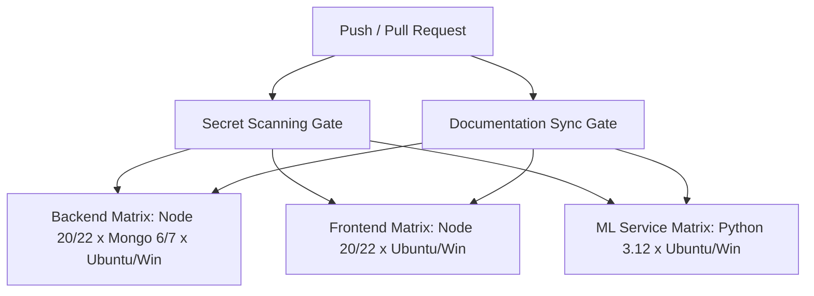

# Production CI/CD Pipeline Specification

## Overview
The WealthGenie CI/CD pipeline is built with GitHub Actions (`.github/workflows/ci.yml`) to enforce production-grade continuous integration across Node.js, Python FastAPI, and React JS runtimes.

## Jobs & Architecture Matrix

### 1. Secret Scanning Gate (`secret-scan-gate`)
Runs `node scripts/secret-scanner.js --all` across all repository files to detect AWS keys, OpenAI keys, JWT secrets, MongoDB URLs, Redis URLs, Google API keys, GitHub PATs, and private key headers.

### 2. Documentation Sync Gate (`docs-sync-gate`)
Runs `node scripts/check_docs_sync.js` to ensure package version parity across `server/package.json`, `reactapp/package.json`, and `README.md`.

### 3. Backend Quality Matrix (`backend-quality-matrix`)
- **Matrix**: Node.js `20.x`, `22.x` × MongoDB `6.0`, `7.0` × OS `ubuntu-latest`, `windows-latest` (8 combinations).
- **Execution**: `npm ci` → `npm run test:coverage` → `npm run loadtest`.
- **Artifact Upload**: `server/reports/` (coverage, load test benchmarks, mutation scores).

### 4. Frontend Quality Matrix (`frontend-quality-matrix`)
- **Matrix**: Node.js `20.x`, `22.x` × OS `ubuntu-latest`, `windows-latest` (4 combinations).
- **Execution**: `npm ci` → `npm test` (Vitest + JSDOM).

### 5. ML Microservice Quality (`ml-microservice-quality`)
- **Matrix**: Python `3.12` × OS `ubuntu-latest`, `windows-latest` (2 combinations).
- **Execution**: `pip install -r requirements.txt` → `pytest`.
